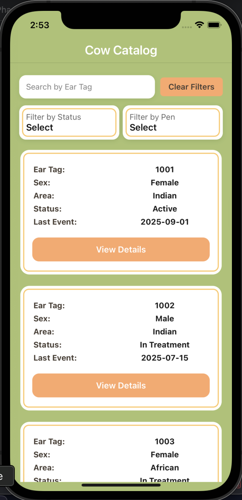
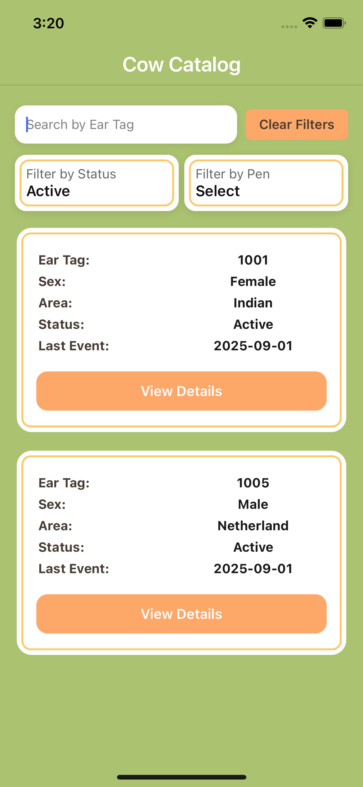
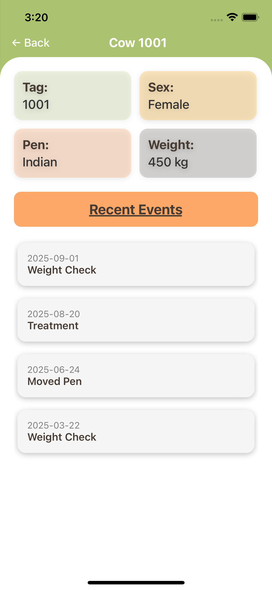

# 🐄 Cow Catalog App

A **React Native** app to manage and explore cow data. The app provides search, filter, and detail views of cows with a modern, pixel-perfect UI design.  

---

## ✨ Features

- 🔍 **Search** cows by ear tag number 
- 🎛️ **Filter** cows by status or pen
- 🗂️ **Persistent Filters** – stay applied when navigating back
- 📄 **Cow Detail Screen** with weight, pen, sex, and recent events timeline
- 🎨 **Pixel Perfect UI** with 3D look, shadows & glass cards
- ⚡ **Optimized Rendering** using memoized components & Context API
- 📶 **Offline Ready** with local JSON + React Query cache

---
## 🛠️ Approach

- **Context API**:  
  - Manages search, status, and pen filters globally
- **React Query**:   
  - Simulates async fetching with caching
- **Custom Dropdown Picker**:   
  - Built with Modal + animations (no external lib)
- **Glassmorphism & Themed UI**:   
  - Clean, modern design
- **Two-tone Detail Screen**:   
  - Green header & white content body

---
## ⚖️ Trade-offs

- **Local JSON instead of real API**:  
  - Full offline support along with simulated json data
- **Custom dropdown instead of libraries**:   
  - Avoids dependency bloat but adds code
- **Context + React Query**:   
  - Built with Modal + animations (no external lib)
 
---
## 📶 Offline Handling

- Data loads from **local JSON file** → works offline:
- React Query caching keeps last known state
- Filtering & searching → work locally, no internet needed

## 🎨 Design Choices  

- **Color Palette**:  
  - Primary: `#ABC270` (Green)  
  - Secondary: `#FEC868` (Yellow)  
  - Accent: `#FDA769` (Orange)  
  - Dark: `#473C33` (Brown)  

- **Glass Effect (RGB with opacity)**:  
  Used semi-transparent backgrounds + blur effect for modern “glass” look.  

- **Responsive Layout**:  
  Optimized for different screen sizes with scrollable lists and flexible grids.  

---
## 📂 Project Structure  
```
cowCatalog/
│── src/
│ ├── components/ # Reusable UI components
│ ├── context/ # Global Context (CowContext)
| ├── data/ # Simulated Json data
| ├── hooks/ # Simulated async fetching
| ├── navigation/ # App navigator
│ ├── screens/ # App Screens
│
│── App.js
│── README.md # Project documentation
```

---
## 🛠️ How to Run  
```
- Install Dependencies
   npm install
   yarn install

- Install pods for iOS
   cd ./ios
   pod install

- Run Project
  - Android
     npm start android
  - iOS
     npm start ios
```

---
## 📸 Screenshots


<p align="center">
  
  
  
</p>
